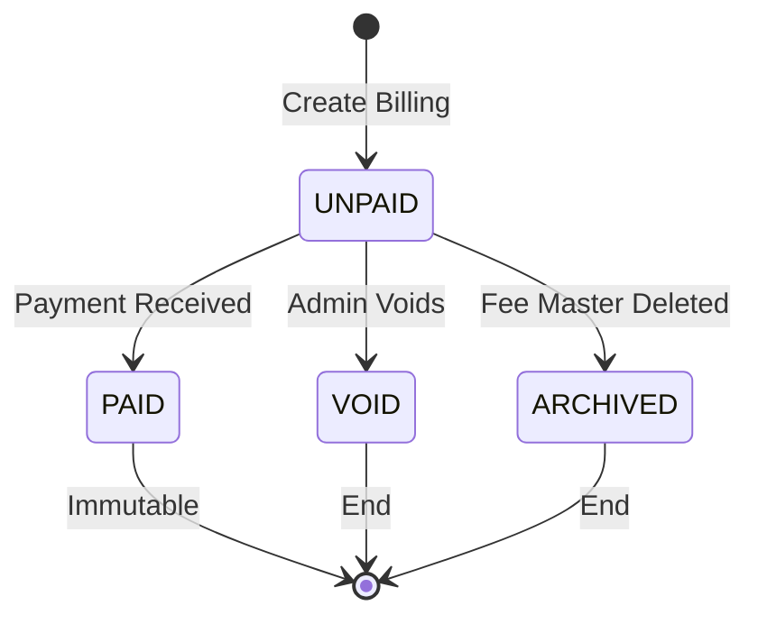
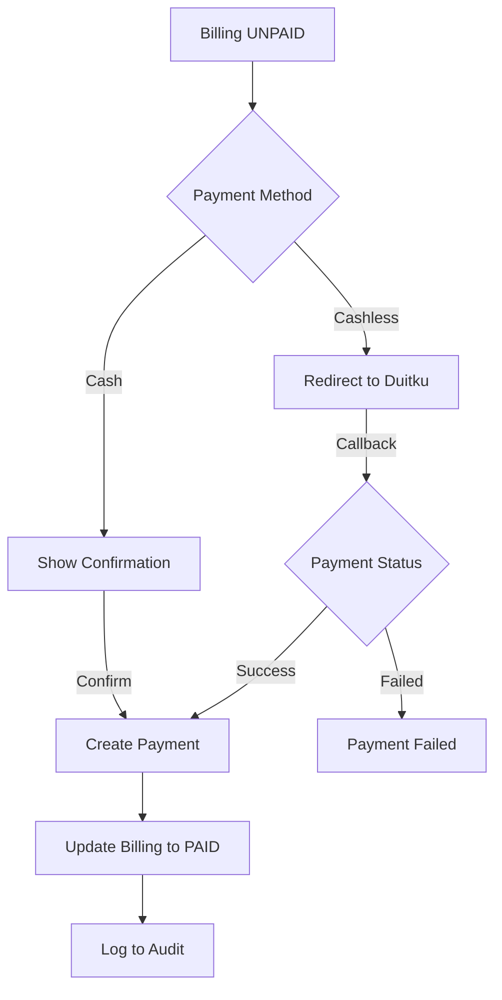
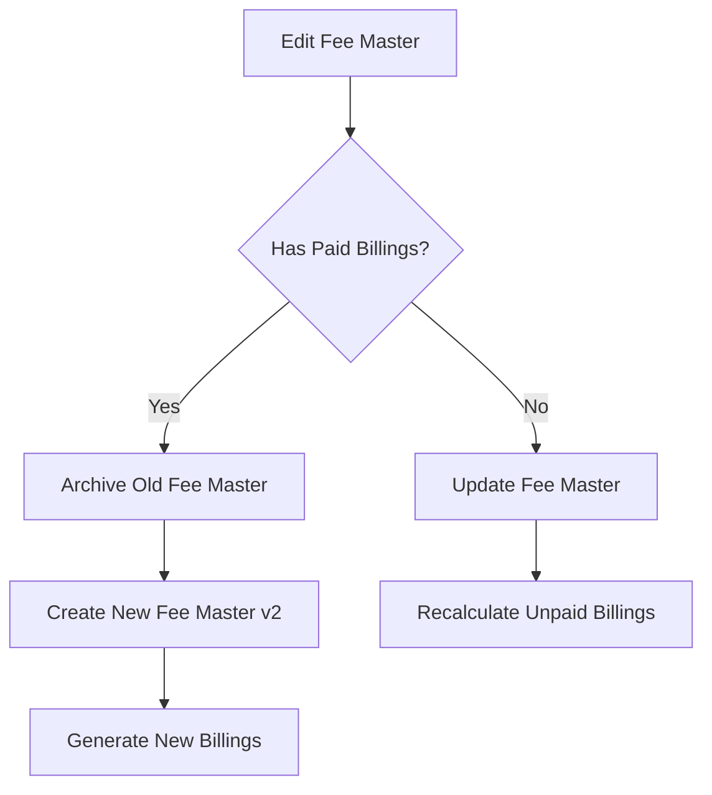

# Immutable Payment & Versioned Billing System

## Overview

This document outlines the architectural changes needed to implement an immutable payment system with versioned billing for the SIM Santri An-Nawawiy application.

## Core Principles

1. **Payments are immutable** - Once created, they cannot be edited or deleted
2. **Delete = Archive** - Using soft deletes, not hard deletes
3. **Paid billings are read-only** - Cannot edit billings with PAID status
4. **Versioned billings** - Fee changes create new billing versions, not updates
5. **Full audit trail** - All actions are logged with who, when, what

---

## Database Schema Changes

### 1. Billings Table Updates

```php
// New columns to add
$table->foreignId('fee_master_id')->nullable()->constrained('fee_masters')->nullOnDelete();
$table->foreignId('version_of')->nullable()->constrained('billings')->nullOnDelete(); // For versioning
$table->integer('version')->default(1); // Version number
$table->boolean('visible_to_wali')->default(true); // Hide archived billings from wali
$table->foreignId('archived_by')->nullable()->constrained('users')->nullOnDelete();
$table->timestamp('archived_at')->nullable();
$table->softDeletes(); // Soft delete support
$table->text('archive_reason')->nullable();

// Status enum remains: UNPAID, PAID, EXPIRED, VOID
```

### 2. Payments Table Updates

```php
// New columns to add
$table->foreignId('admin_id')->constrained('users'); // Who processed the payment
$table->string('method')->default('cash'); // cash, duitku
$table->string('duitku_reference')->nullable(); // Duitku transaction reference
$table->enum('status', ['pending', 'paid', 'failed'])->default('paid'); // For cashless tracking
$table->text('notes')->nullable();
$table->softDeletes(); // For audit trail, even though "deleted" payments just mark as void

// Remove: $table->string('payment_method'); // Replaced by 'method'
```

### 3. Fee Masters Table Updates

```php
// New columns to add
$table->boolean('is_active')->default(true); // Active/inactive status
$table->foreignId('replaced_by')->nullable()->constrained('fee_masters')->nullOnDelete(); // When archived, points to new version
$table->softDeletes(); // Soft delete support
```

### 4. New Audit Logs Table

```php
Schema::create('audit_logs', function (Blueprint $table) {
    $table->id();
    $table->string('log_type'); // fee_master_created, billing_archived, payment_processed, etc.
    $table->morphs('subject'); // The entity being acted upon
    $table->foreignId('performed_by')->constrained('users');
    $table->json('old_values')->nullable();
    $table->json('new_values')->nullable();
    $table->string('ip_address')->nullable();
    $table->text('description')->nullable();
    $table->timestamps();
});
```

---

## Business Logic

### Fee Master Management

#### Creating Fee Master
1. Admin creates fee master with target unit/residence
2. System shows preview: "Akan membuat X tagihan untuk santri dengan kriteria: [unit], [residence]. Lanjutkan?"
3. On confirm, generate billings for matching students

#### Editing Fee Master
1. Check if any paid billings exist
2. If yes:
   - Archive old fee master (soft delete)
   - Create new fee master (version 2)
   - Generate new billings for affected students
   - Keep old billings for audit
3. If no paid billings:
   - Update fee master
   - Recalculate all unpaid billings

#### Deleting Fee Master
1. Soft delete fee master
2. Archive related billings:
   - Set `visible_to_wali = false`
   - Set `archived_by = current_user`
   - Set `archived_at = now()`
   - Keep payments intact for audit

---

### Billing Management

#### Creating Billing (Manual)
1. Admin selects student and fee master
2. System calculates amounts based on discounts
3. Create billing with status UNPAID

#### Editing Billing
- **If status = PAID**: Show error "Tagihan yang sudah dibayar tidak dapat diubah"
- **If status = UNPAID**: Allow editing of discount_applied, final_amount

#### Voiding Billing
- Only for UNPAID billings
- Set status to VOID
- Log to audit trail

---

### Payment Processing

#### Cash Payment (Individual)
1. Admin clicks "Bayar" on billing
2. Show confirmation dialog with billing details
3. On confirm:
   - Create payment record with `admin_id`, `method = cash`, `status = paid`
   - Update billing status to PAID
   - Log to audit trail

#### Cash Payment (Bulk)
1. Admin selects multiple billings (checkbox/select all)
2. Click "Bayar Massal"
3. Show preview: list of santri, total nominal
4. On confirm:
   - DB::transaction to create all payments
   - Update all billing statuses to PAID
   - Log each payment to audit trail

#### Cashless Payment (Duitku)
1. Admin/Wali clicks "Bayar via Duitku"
2. Create payment record with `method = duitku`, `status = pending`
3. Redirect to Duitku payment page
4. On callback:
   - Update payment status (paid/failed)
   - If paid: update billing status to PAID
   - Log to audit trail

---

## UI Changes

### Billing Index
- Add pagination
- Add search (by student name, NIS, billing title)
- Show "Bayar" button only for UNPAID billings
- PAID billings: show payment details (read-only)
- Add bulk selection checkboxes
- Add "Bayar Massal" button

### Billing Form
- Remove if billing status = PAID
- Show "Read Only" badge for paid billings

### Payment Entry
- **DELETE THIS COMPONENT** - All payments through Billing → Bayar

### Archive Page (New)
- Accessible by admin/superadmin only
- Show archived fee masters
- Show archived billings
- Show which students paid before archival

---

## Implementation Phases

### Phase 1: Database Schema
- [ ] Create migration for billings table updates
- [ ] Create migration for payments table updates
- [ ] Create migration for fee_masters table updates
- [ ] Create migration for audit_logs table
- [ ] Update models with new relationships and fillable

### Phase 2: Audit System
- [ ] Create AuditLog model
- [ ] Create AuditService for logging
- [ ] Add observer for automatic logging

### Phase 3: Fee Master Changes
- [ ] Update FeeMasterForm with preview functionality
- [ ] Update FeeMasterObserver for versioning logic
- [ ] Add archive functionality

### Phase 4: Billing Changes
- [ ] Update BillingService for versioning
- [ ] Add edit restrictions for paid billings
- [ ] Add void functionality
- [ ] Update BillingIndex with pagination/search
- [ ] Update BillingForm for read-only paid billings

### Phase 5: Payment Changes
- [ ] Remove PaymentEntry component
- [ ] Add payment processing to BillingIndex
- [ ] Implement bulk payment
- [ ] Update Duitku integration

### Phase 6: Archive Page
- [ ] Create ArchiveController
- [ ] Create archive views
- [ ] Add route protection (admin only)

---

## Mermaid Diagrams

### Billing State Machine



### Payment Flow



### Fee Master Versioning



---

## Security Considerations

1. **Role-based access**: Only admin/superadmin can access archive
2. **Immutable payments**: No update/delete routes for payments
3. **Audit trail**: All financial actions logged
4. **Transaction safety**: Bulk operations wrapped in DB transactions
5. **Validation**: Server-side validation for all payment amounts

---

## Files to Modify/Create

### Migrations
- `database/migrations/2026_02_28_210000_add_versioning_to_billings_table.php`
- `database/migrations/2026_02_28_210001_add_immutable_to_payments_table.php`
- `database/migrations/2026_02_28_210002_add_soft_deletes_to_fee_masters_table.php`
- `database/migrations/2026_02_28_210003_create_audit_logs_table.php`

### Models
- `app/Models/Billing.php` - Add versioning, soft deletes
- `app/Models/Payment.php` - Add admin_id, status, soft deletes
- `app/Models/FeeMaster.php` - Add soft deletes, is_active
- `app/Models/AuditLog.php` - New model

### Services
- `app/Services/PaymentService.php` - New service for payment processing
- `app/Services/AuditService.php` - New service for audit logging

### Livewire Components
- `app/Livewire/BillingIndex.php` - Add bulk payment, pagination, search
- `app/Livewire/ArchiveIndex.php` - New component for archive view

### Views
- `resources/views/livewire/billing-index.blade.php` - Update UI
- `resources/views/livewire/archive-index.blade.php` - New archive view

### Observers
- `app/Observers/PaymentObserver.php` - New observer for audit logging

### Routes
- `routes/web.php` - Add archive routes

---

## Next Steps

1. Review and approve this plan
2. Switch to Code mode for implementation
3. Implement phase by phase
4. Test each phase before moving to next
